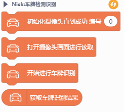
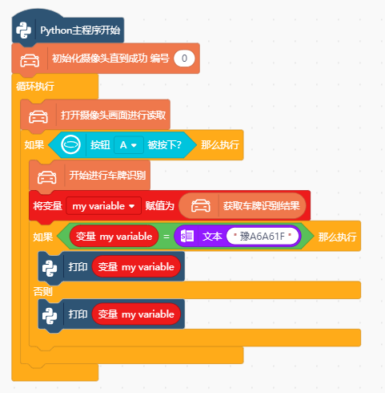

# 车牌识别

# 注意

此库是在行空板中使用，则需要先安装一些依赖库，方法为：

- 首先下载gitee中的**Chinese_license_plate_detection_recognition.zip**文件，解压之后，放到行空板根目录root下

- 运行**1-Install_dependency.py**安装本地库，等待代码执行完毕。

- 安装完成之后，运行后续案例。

# 积木

# 程序实例
示例程序1

# 支持列表

|主板型号|实时模式|ArduinoC|MicroPython|python|备注|
|-----|-----|-----|-----|:-----:|-----|
|uno|||||||
|micro:bit|||||||
|mpython|||||||
|arduinonano|||||||
|leonardo|||||||
|mega2560|||||||
|行空板||||√|||

# 更新日志

V0.0.1 基础功能完成
